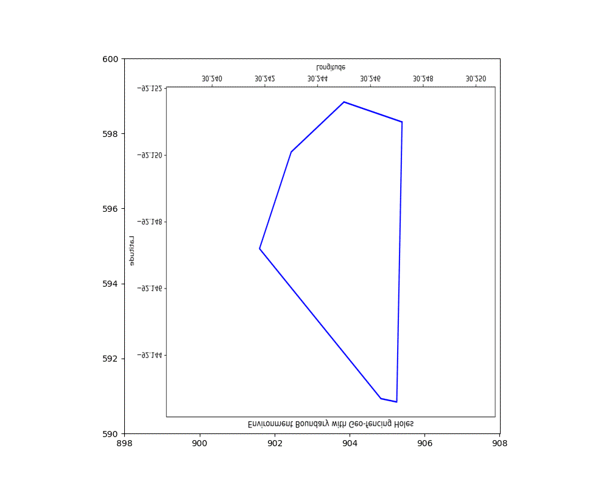

# MAE 598: Multi-Robot Systems - Field-Based Controller Implementation and SCoPP Optimization

### Team Members: **Emil Roy**, **Deepit Arora**, **Pablo Garcia**

## Project Overview
This repository contains the implementation of a field-based controller and optimization of the **Scalable Coverage Path Planning (SCoPP)** algorithm, specifically the Quick Load Balancer (QLB) variant, as presented in the research paper:

[**Scalable Coverage Path Planning of Multi-Robot Teams for Monitoring Non-Convex Areas**](https://arxiv.org/abs/2103.14709)

Find their original implementation of SCoPP [here](https://github.com/adamslab-ub/SCoPP/tree/main)

Our work focuses on leveraging the SCoPP (QLB) algorithm to enable multi-robot teams to efficiently monitor and navigate non-convex areas. The implementation aims to refine the algorithm’s performance and apply it in simulations to evaluate coverage efficiency. We will be analyzing the behavior of this model and seeing how it works with the newly implemented field based controller.

### Key Components
1. **Python Implementation**:
   - **Field-Based Controller**:
     Implements a field-based control mechanism to enable robots to navigate and monitor assigned areas while respecting no-fly zones or obstacles referred to in the code as geo-fencing holes.
   - **SCoPP Optimization**:
     Optimizes the computation time of the SCoPP algorithm for better performance in multi-robot systems.

2. **Matlab Simulations**:
   - Provides tools to simulate multi-robot behaviors using the SCoPP (QLB) algorithm in MATLAB.
   - Includes functionality for generating detailed visualizations of robot trajectories and coverage.

### Dependencies:
Install Python dependencies using:
```bash
pip install -r requirements.txt
```
### Main Script:
To run the algorithm on a chosen environment found in `environments.py`, run
```
python main.py
```
One can change the environment to be any found in the environments file created by the authors of the original paper. In `main.py` simply change the  environment variable in line 10.


## Simulations of robots over flood maps:
<div style="justify-content: space-around; gap: 20px;">
  <figure>
    
    <figcaption>Small Lafayette Flood Map</figcaption>
  </figure>

  <figure>
    
    <figcaption>Medium Lafayette Flood Map</figcaption>
  </figure>

  <figure>
    
    <figcaption>Large Lafayette Flood Map.</figcaption>
  </figure>
</div>